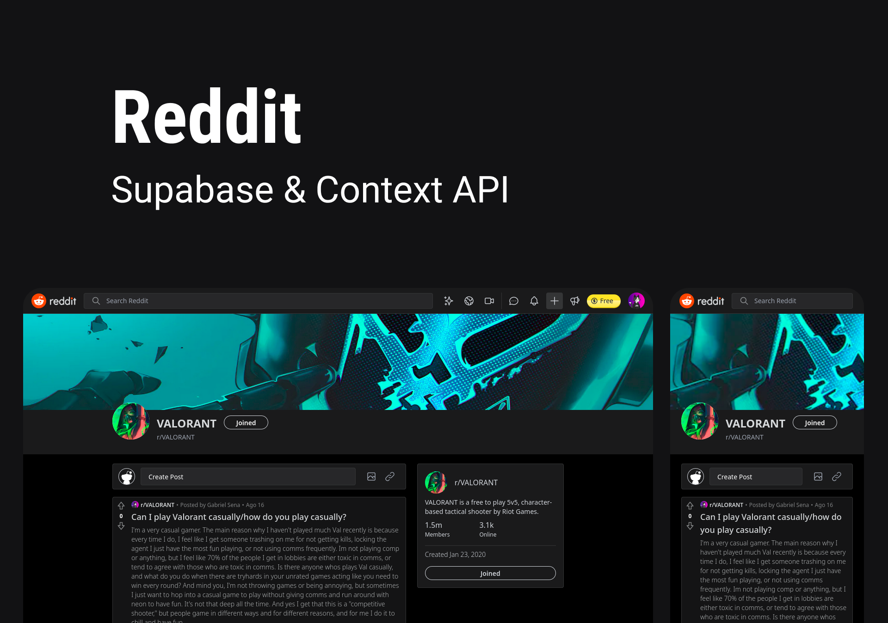

# Reddit | Supabase & Context API

> Clone the Reddit interface using Supabase as a backend as a service and using the React Context API to manage global application states such as the user session. All this with super dynamic routes and real-time server responses thanks to the SWR library, in which the components will receive a constant and automatic stream of data updates and the user interface will always be fast and reactive. 
